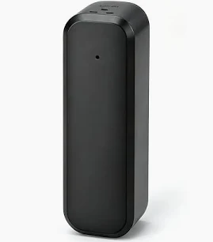

# Tuya ZG-IR01 Zigbee IR Blaster (Battery) — Hubitat driver



Hubitat driver for the battery-powered Tuya Zigbee IR blaster that reports as
manufacturer `_TZE200_33rdmvgw`, model `ZG-IR01`. These are sold unbranded on
AliExpress under many names; the model string in Hubitat's device **Data**
section is the reliable way to identify one.

The device is both an IR blaster (learn and send) and a temperature / humidity
sensor.

## Why this fork exists

This is a fork of [luckygerbils/hubitat-tuya-zigbee-ir][upstream] by Sean
Anastasi, which targets the mains-powered ZS06 / TS1201. On the battery ZG-IR01
that driver can **learn** codes but cannot **send** them: the firmware requests
every data chunk with sequence `0` instead of echoing the sequence the hub
assigned, so the send aborts on the first chunk with a `NullPointerException`.
Learning is unaffected because there the device picks the sequence itself.

[upstream]: https://github.com/luckygerbils/hubitat-tuya-zigbee-ir

## Changes from upstream

1. **Sending works on the ZG-IR01** — tolerate a device that does not echo the
   hub-assigned sequence number.
2. **Abandoned send buffers are reaped by age.** Previously an interrupted
   transfer leaked its buffer, which (with 1) wedged every later send.
3. **Fingerprint for `_TZE200_33rdmvgw` / `ZG-IR01`** so it auto-selects on join
   instead of falling back to a generic `Device`.
4. **Temperature, humidity and battery** (clusters `0x0402`, `0x0405`, `0x0001`),
   previously logged as `unknown cluster ... Ignoring`.
5. **`codeList` attribute** — a readable index of learned codes.
6. **`Refresh`** — rebuilds `codeList` and reads the sensor attributes on demand.
7. **`addCode`** — store a code by name without learning it, for protocols this
   blaster cannot capture (see below).
8. **`forgetAllCodes`** — clear every code and its button mappings at once.
9. **`lastSendStatus` attribute** — byte and chunk counts for the last send, or a
   value still reading `sending …` if the transfer stalled. The Zigbee transfer is
   otherwise only visible in the live log.
10. **PushableButton contract honoured** — `numberOfButtons` is set and `push`
    emits a `pushed` event; neither happened before.

The upstream TS1201 fingerprint is retained but untested here.

## Install

**Hubitat Package Manager** — *Install → From a URL*, then paste:

```
https://raw.githubusercontent.com/jon7sky/hubitat-zg-ir01/main/packageManifest.json
```

**Or manually** — *Drivers Code → New Driver → Import*, paste the raw URL of
`drivers/zg-ir01-ir-blaster.groovy`.

## Use

- `learn` — optionally with a name; press the button on your remote when the
  blaster's LED lights.
- `sendCode` — a learned code's name, or raw Base64.
- `addCode` — store a Base64 code under a name without learning it.
- `forgetCode` / `forgetAllCodes` — remove one code, or all of them.
- `mapButton` / `unmapButton` — bind a code to a button number for `push`.
- `Refresh` — refresh `codeList`, temperature, humidity and battery.

**The red LED on the blaster is the only reliable proof that IR was actually
transmitted.** `code fully sent` in the log means the hub finished handing the
bytes to the blaster — the device can accept a code in full and then decline to
emit it, silently.

Learned codes live in `state.learnedCodes` on the device and are **destroyed if
the device is removed** — copy them out first.

## Air conditioner and mini-split remotes

AC remotes transmit their entire state (mode, setpoint, fan, vane) in each frame,
so every combination of settings is a separate code. Learn the few states you
actually use rather than trying to model the remote. There is no toggle bit or
clock field in the frames tested here, so a captured code replays indefinitely.

Beyond that, this blaster has three limitations that matter for AC remotes. They
were established by experiment against a Mitsubishi wall unit (`KM09E` remote,
144-bit protocol); the details will differ by remote but the shape of the problem
will not.

### It does not replay raw timings — it decodes and validates

Feeding it a captured code with a **single data bit flipped** (breaking the
protocol's own integrity check) makes it refuse to transmit, while the unmodified
code and a different-but-valid frame both work. So the device parses the frame,
validates it, and only then emits.

Three consequences:

- **Some remotes cannot be learned at all.** If the protocol is not in its
  library, `learn` yields nothing — not a truncated or empty capture, simply no
  result. A Mitsubishi 144-bit remote failed this way while a MITSUBISHI136
  remote in the same room captured fine.
- Hand-built codes must be *structurally valid*, not merely well-formed bytes.
  An out-of-range field value is refused.
- Usefully, this makes the device its own validator: if the LED blinks, the frame
  parsed.

### Transmit size ceiling of roughly 295 bytes

A single 144-bit frame (295 bytes) transmits. The same command as the **two
frames the remote actually sends** (589 bytes) does not — the Zigbee transfer
completes and the log says `code fully sent`, but nothing is emitted.

Generate **single-frame** codes. The doubled transmission is the remote's
redundancy; air conditioners tested here act on one frame.

### It takes Broadlink encoding, not Tuya/Zosung

Codes are raw Broadlink containers beginning `0x26`. This device **rejects**
Tuya-encoded strings — the same incompatibility reported in
[zigbee2mqtt#32812](https://github.com/Koenkk/zigbee2mqtt/issues/32812). Note
that the mains **TS1201 stores the Tuya compressed format instead** (leading
`0x08`, FastLZ over microsecond timings), so **codes are not interchangeable
between the two blasters** even though both use this driver.

The Broadlink container's 2-byte length field at offset 2 counts the **total**
including the 4-byte header, not the payload alone. Getting this wrong makes a
code fail silently.

### Getting codes for a protocol this blaster cannot learn

Any other blaster can act as the learner — a Broadlink/BestCon RM, or a wired
TS1201. Capture the command there, then convert it to a single-frame Broadlink
container and load it here with `addCode`.

When decoding a capture, locate the frame header (a mark over 3 ms followed by a
1.5–2 ms space) rather than assuming it starts at index 0; a learner that begins
recording late will clip the first frame's header. Protocols that send the frame
twice usually leave the second copy intact.

## Licence

GPL-3.0, inherited from upstream. See [LICENSE](LICENSE).
